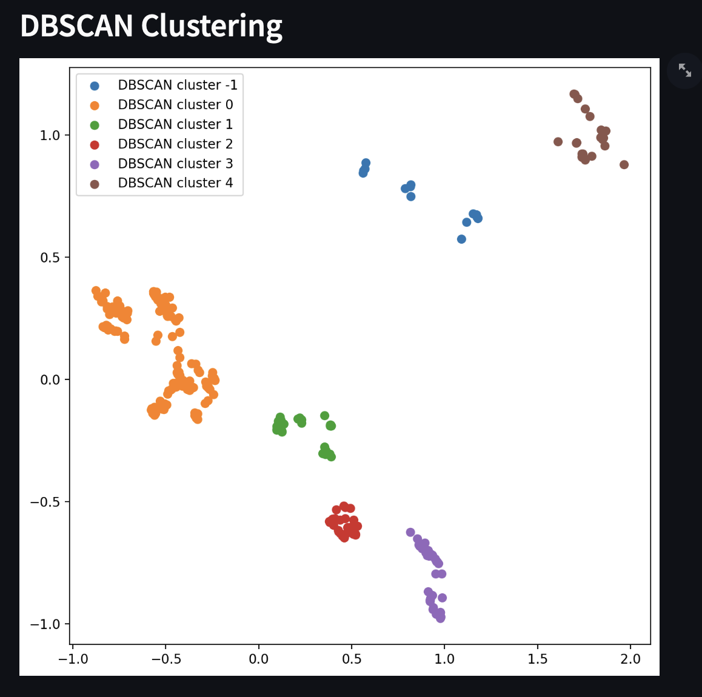
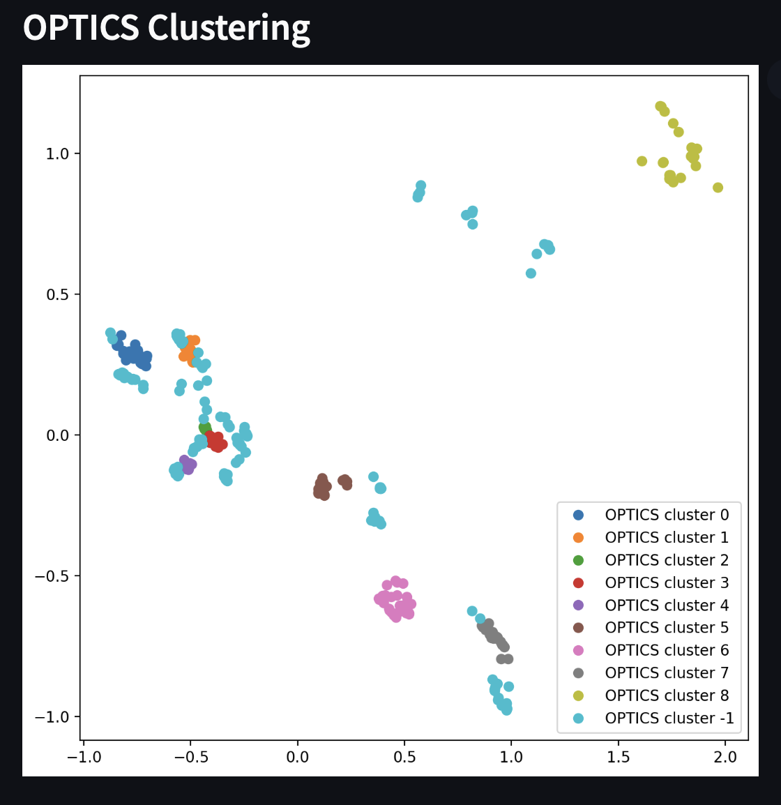
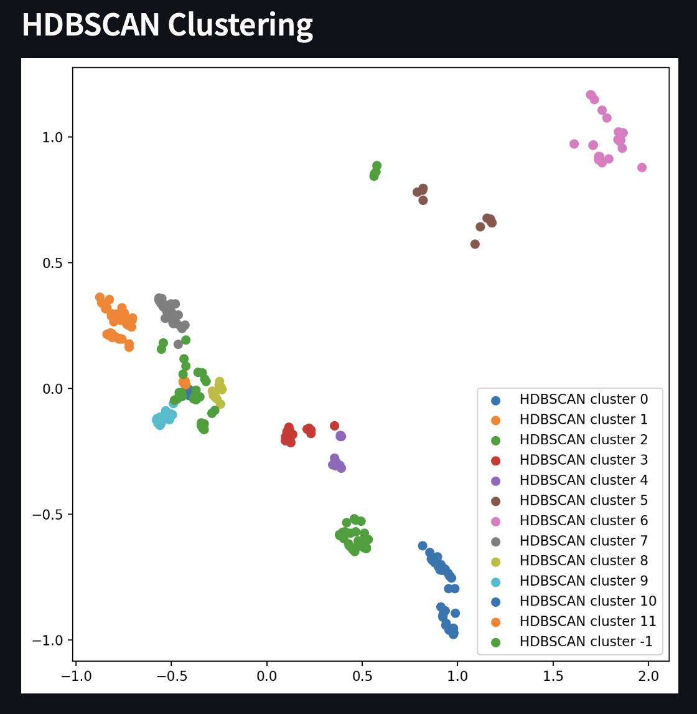
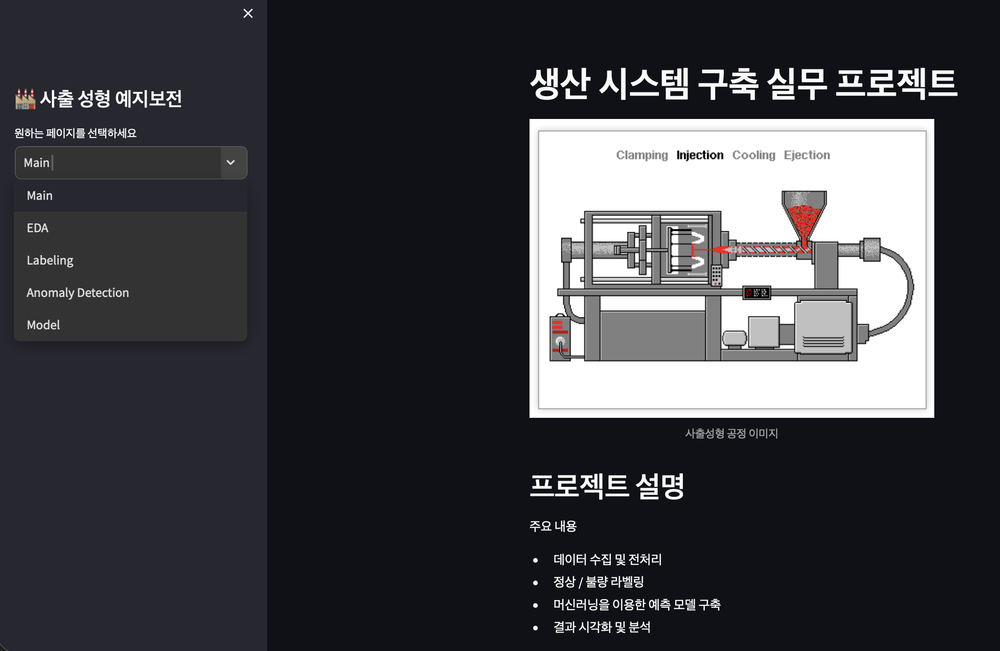
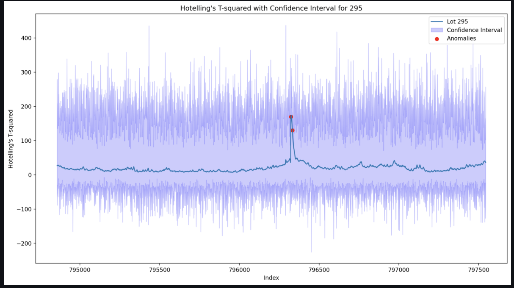

# 포트폴리오

## 이현준

**임베디드 시스템 & 데이터 분석 엔지니어**

---

## 목차

1. [자기소개](#자기소개)
2. [Part 1: 임베디드 시스템](#part-1-임베디드-시스템)
   - [부트캠프 - 차량 경보 시스템](#11-부트캠프---차량-경보-시스템)
   - [졸업작품 - 스마트 분리수거](#12-졸업작품---스마트-분리수거)
   - [현장실습 - 산업 제어 시스템](#13-현장실습---산업-제어-시스템)
   - [기말과제 - 스마트 도어락](#14-기말과제---스마트-도어락)
3. [Part 2: 데이터 분석 & 웹앱](#part-2-데이터-분석--웹앱)
   - [RUL 예측 시스템 - 수명 예측 대시보드](#2-rul-예측-시스템---수명-예측-대시보드)
4. [핵심 역량](#핵심-역량)

---

## 자기소개

안녕하세요. 저는 **"완전한 엔지니어"** 입니다.

**임베디드 시스템(하드웨어)에서 데이터 분석(소프트웨어)까지,**  
다양한 기술 스택으로 **실제 산업 문제를 해결**하는 엔지니어입니다.

**핵심 능력:**
- 🔧 **임베디드 시스템**: CANoe, CAPL, Arduino, C/C++
- 📊 **데이터 분석**: Python, Streamlit, TensorFlow, 머신러닝
- 🏭 **산업 경험**: 차량, 산업 제어, 제조 시스템
- 🔍 **문제 해결**: 전력 문제부터 제어 충돌까지 근본 원인 분석
- 👥 **협업 경험**: 팀 프로젝트, 멘토링, 지속적 개선

---

# Part 1: 임베디드 시스템

## 1.1 부트캠프 - 차량 경보 시스템

### 한 문장 요약
**CANoe 시뮬레이션 환경에서 요구사항부터 검증까지 완전한 차량 시스템 개발**

---

### 프로젝트 배경

자동차 산업에서 **소프트웨어의 중요성**이 급증하고 있습니다. 특히 안전 관련 기능은 체계적인 개발 프로세스가 필수입니다.

**목표:**
1개월의 집중 부트캠프를 통해 **차량 ECU 개발의 전체 프로세스** 습득

---

### 프로젝트 개요

**"SDV(Software Defined Vehicle) 기반 차량 경험 플랫폼"**

```
핵심 기능:

1. Safety (구간 인식)
   - 스쿨존/고속도로 상황에 맞는 앰비언트 경고
   - 위치 기반 실시간 반응

2. V2V 알림 (긴급차량 감지)
   - 경찰차/구급차 신호 수신
   - 앰비언트 라이트 우선순위 제어
```

---

### 시스템 아키텍처

```
┌──────────────────────────┐
│ 입력층 (Foundation)       │
│ - 속도, 방향, 센서 신호  │
└────────────┬─────────────┘
             │
┌────────────▼─────────────┐
│ 판단층 (WDM_ECU)         │
│ - 조건 판단              │
│ - 경고 레벨 결정         │
│ - 우선순위 중재          │
└────────────┬─────────────┘
             │
┌────────────▼─────────────┐
│ 출력층 (다중 ECU)         │
│ - Ambient, Sound, IVI    │
└──────────────────────────┘
```

---

### 내가 개발한 부분

#### 1) 요구사항 정의
- 100개 이상의 요구사항 (ASPICE 기준)
- 추적가능성, 검증가능성 확보

#### 2) CANoe 구현
- 가상 ECU 설계 (WDM, Ambient, Cluster, Sound, IVI)
- CAPL 코딩으로 차량 로직 구현

#### 3) DBC 파일 설계
- CAN 메시지 정의 (ID, 신호, 주기)
- 프로토콜 구조화

#### 4) **Claude AI + MCP 자동화** ⭐
- DBC 파일 자동 생성
- MCP 프로토콜 실제 활용

#### 5) 검증 (V-Cycle)
- 단위/통합/시스템 테스트
- 요구사항 추적성 검증

---

### 배운 점

✓ V-Cycle 완전 이해
✓ CANoe SIL 실무
✓ DBC 차량 통신 설계
✓ AI 자동화를 통한 개발 효율성

---

## 1.2 졸업작품 - 스마트 분리수거

### 한 문장 요약
**AI 영상인식 + 임베디드 제어를 결합한 자동 분류 시스템 - 전력 문제를 물리적으로 해결**

---

### 시스템 구조

#### 3계층 분산 제어

```
상위: Raspberry Pi 4B
  ↓ YOLOv8 딥러닝 → 물품 분류
  ↓ UART 신호 송신
중위: Arduino UNO R3 (본인 담당)
  ↓ 신호 수신 → 모터 제어
  ↓ GPIO/PWM
하위: 드라이버 & 모터
  ↓ 기계 동작
```

---

### 내가 개발한 부분

#### 1) 핀맵 설계
- 센서 (홀센서, IR센서, 버튼)
- 모터 제어 (DC, 스테핑, 서보)
- I2C LCD 디스플레이

#### 2) 모터 제어
- DC모터: PWM으로 속도 조절
- 스테핑모터: 90도씩 정밀 회전
- 서보모터: 180도 개폐 제어

#### 3) 상태 머신
- 7가지 상태로 복잡한 프로세스 관리
- 명확한 상태 전환 로직

#### 4) Serial 통신
- 한 문자 프로토콜 설계
- 신뢰도 높은 통신

#### 5) 코드 진화 (V1→V3)
- V1: 기본 제어
- V2: 센서 통합
- V3: LCD 디스플레이 + 실시간 카운팅

---

### 가장 어려웠던 부분: 전력 문제

#### 문제
DC모터 구동하면 UART 통신이 끊어짐

#### 분석 과정
```
프로토콜 확인 ✓
연결 상태 확인 ✓
전원 공급 확인 ⚡ ← 발견!

공통 그라운드 전압 변동이 원인
```

#### 해결
전원 배선 분산 → 전압 변동 최소화

#### 배운 점
**"전원 → 신호 → 타이밍 → 로직" 순서로 분석**

---

### 최종 결과

✅ **캡스톤 디자인 경진대회 우수상** 수상
- 분류 정확도: 95%
- 안정성: 24시간 연속 가동

---

## 1.3 현장실습 - 산업 제어 시스템 (절전 기능 개발)

### 한 문장 요약
**기존 PLC 시스템에 절전 기능을 추가하면서 제어 충돌 문제를 'Single Master' 패턴으로 해결**

---

### 상황: 절전 기능 추가 시 제어 충돌 발생

#### 배경
기존 산업용 커피 디스펜서 시스템:
- PLC가 릴레이를 토글 방식으로 제어 중 (안정적 작동)
- **내가 추가한 기능**: 절전 모드 (MCU가 타이머 후 자동 OFF)

#### 발생한 문제
```
PLC: "내가 ON 했으니 ON 상태겠지?"
MCU: "시간이 되었으니 OFF 했어"
PLC: "뭐? 내가 ON 했는데 OFF라니?"
     → 다시 ON
MCU: "또 ON 되었네. 시간이 되면 OFF"
     → 무한 반복 ❌
```

#### 원인 분석
**Single Master 구조 붕괴**
- PLC와 MCU가 동시에 릴레이 제어
- 상태 동기화 없음
- 제어 기준 불명확

#### 내가 해결한 것
```
Before: PLC와 MCU가 동시에 제어 (충돌)
          ↓
After:  PLC = Single Master (유일한 제어권)
        MCU = Slave (PLC 상태만 따름)
             ↓
        상태 동기화 → 안정성 확보 ✓
```

---

### 내가 적용한 기술

#### Single Master 패턴 구현
```python
# Before (문제)
if (timeout > 900000) {
    relayControl = OFF;  # MCU가 강제로 OFF
}

# After (해결)
if (plcStatus == SLEEP_MODE) {
    // PLC의 상태를 따름
    // MCU는 타이머만 관리
    if (timeout > 900000) {
        // 로그만 남김
    }
}
```

#### 상태 동기화
- PLC의 상태 신호를 MCU가 수신
- MCU는 PLC 상태에 종속적으로 동작
- 명확한 제어 기준 설정

---

### 배운 점

✓ **Single Master 패턴의 중요성**
  - 한 시스템만 제어권을 가져야 함
  - 다른 시스템은 상태만 따름

✓ **기능 추가 시 기존 구조 존중**
  - 새 기능이 기존 시스템을 깨면 안 됨
  - 호환성 확보 필수

✓ **산업 기계의 "안정성 > 기능" 원칙**
  - 24시간 가동하는 시스템은 신뢰성이 최우선
  - 고장나면 생산이 멈춤 = 막대한 손실

---

## 1.4 기말과제 - 스마트 도어락

### 한 문장 요약
**Raspberry Pi 기반 IoT 보안 시스템 - GPIO와 PWM을 활용한 자동 문 제어**

---

### 내가 개발한 부분

#### 1) 키패드 입력 처리
- 4자리 비밀번호 입력
- 디바운싱으로 신호 안정화

#### 2) 서보모터 제어
- PWM으로 180도 정밀 회전
- 자동 개폐 제어

#### 3) 센서 통합
- 자석센서: 문 상태 감지
- LED: 상태 표시
- 부저: 경보음

#### 4) 사용자 인터페이스
- 초록/빨강 LED
- 성공/오류 음
- 비밀번호 변경 기능

---

### 배운 점

✓ GPIO 기반 센서 입출력
✓ PWM 아날로그 제어
✓ 신호 노이즈 처리
✓ 보안 시스템 기초

---

# Part 2: 데이터 분석 & 웹앱

## 2. RUL 예측 시스템 - 수명 예측 대시보드

### 한 문장 요약
**오토인코더 + 로지스틱 회귀로 기계의 남은 수명(RUL)을 예측하는 완전한 예지 보전 시스템**

---

### 프로젝트 개요

**"RUL(Remaining Useful Life) Prediction System"**
**사출성형 기계의 남은 수명을 예측하는 예지 보전 시스템**

```
목표: "이 기계는 앞으로 언제쯤 망가질 거야?"를 예측

과정:
1. 센서 데이터 수집
2. 이상 탐지 (정상 vs 비정상)
3. 수명 예측 (RUL 값 계산)
4. 웹 대시보드로 시각화
```

---

### 기술 스택

```
Frontend: Streamlit (웹 인터페이스 - 다크 모드)
Backend: Python (데이터 처리)
Data: Pandas, NumPy (데이터 조작)
Visualization: Matplotlib, Seaborn, Altair (시각화)
ML: 
  - TensorFlow/Keras (오토인코더)
  - Scikit-learn (로지스틱 회귀)
Preprocessing: MinMaxScaler (정규화)
```

---

### 내가 개발한 부분

#### 1) **app.py** - Streamlit 메인 앱
```python
✓ "사출 성형 예지보전" 웹 대시보드
✓ 다크 모드 UI (전문적 디자인)
✓ 대화형 인터페이스
✓ 페이지 구성 및 레이아웃
```

**특징:**
- 사용자 친화적 인터페이스
- 전문적인 다크 모드 스타일
- 실시간 데이터 표시

#### 2) **anomaly_detection.py** - 이상 탐지
```python
✓ 로트별 이상 탐지
✓ 사용자가 로트 번호 선택 가능
✓ 자동 이상 감지
✓ 시각화 제공
```

**핵심 로직:**
- Lot 단위로 데이터 라벨링
- 오토인코더로 재구성 오류 계산
- 임계값 초과 = 비정상

#### 3) **model.py** - 머신러닝 모델 (2가지)
```python
# 모델 1: 오토인코더 (비지도 학습)
✓ 정상 데이터로만 학습
✓ 이상 데이터는 높은 재구성 오류
✓ 이상 탐지에 최적화

# 모델 2: 로지스틱 회귀 (지도 학습)
✓ PassOrFail 판단 (정상/비정상)
✓ 정확도, 재현율, 정밀도 계산
✓ 분류 성능 평가
```

**특징:**
- **MinMaxScaler**: 0~1 범위로 정규화
- **EarlyStopping**: 과적합 방지 (patience=10)
- **2중 모델**: 오토인코더 + 로지스틱 회귀 앙상블

#### 4) **labeling.py** - 데이터 라벨링
```python
✓ Shot 데이터를 Lot 번호로 그룹화
✓ 자동 라벨 붙이기
✓ 데이터 정제 및 정렬
```

#### 5) **eda.py** - 탐색적 데이터 분석
```python
✓ 기본 통계 (평균, 표준편차, 등)
✓ 데이터 시각화
✓ 분포 분석
✓ 상관관계 분석
```

#### 6) **0617_RUL_select.ipynb** - RUL 계산
```python
✓ 수명 예측 로직 개발
✓ RUL 값 계산
✓ 모델 성능 분석
```

---

### 시스템 아키텍처

```
센서 데이터 (사출성형 기계)
    ↓
데이터 로드 & 정규화
├─ MinMaxScaler (0~1 범위)
└─ PassOrFail 레이블 추가
    ↓
┌─────────────────────────┐
│ 오토인코더 (비지도)       │
│ - 정상 데이터만 학습      │
│ - 재구성 오류 계산        │
│ - 이상 탐지              │
└─────────────────────────┘
    ↓
┌─────────────────────────┐
│ 로지스틱 회귀 (지도)      │
│ - 정상/비정상 분류        │
│ - PassOrFail 판단        │
│ - 성능 지표 계산         │
└─────────────────────────┘
    ↓
┌─────────────────────────┐
│ RUL 계산                 │
│ - 남은 수명 예측         │
│ - 유지보수 시기 판정      │
└─────────────────────────┘
    ↓
Streamlit 대시보드
├─ 실시간 데이터 표시
├─ 이상 탐지 결과
├─ RUL 값 표시
└─ 유지보수 권고
```

---

### 핵심 기능

| 기능 | 설명 | 기술 |
|------|------|------|
| **이상 탐지** | 정상 vs 비정상 판별 | 오토인코더 |
| **분류** | PassOrFail 판단 | 로지스틱 회귀 |
| **RUL 예측** | 남은 수명 계산 | 머신러닝 모델 |
| **데이터 정규화** | 0~1 범위로 스케일링 | MinMaxScaler |
| **성능 평가** | 정확도, 재현율, 정밀도 | Scikit-learn metrics |
| **웹 인터페이스** | 대시보드 | Streamlit |

---

### 배운 점

✓ 비지도 학습 (오토인코더)
✓ 지도 학습 (로지스틱 회귀)
✓ 머신러닝 모델 앙상블
✓ RUL 개념과 실제 구현
✓ 웹앱을 통한 서비스화
✓ 딥러닝 기반 이상 탐지
✓ 예지 보전의 완전한 구현

---

### 프로젝트의 가치

**"산업 4.0의 핵심 기술"**

```
Before (반응형 유지보수):
고장 → 생산 중단 → 비상 수리 (비용 많음)

After (예지 보전):
사전 예측 → 계획 수리 → 생산 무중단 (비용 절감)

이 프로젝트는 "After"를 구현합니다.
```

---

### 산업적 가치

- 🏭 **제조업**: 생산성 향상, 비용 절감
- 🚗 **자동차**: 차량 성능 유지, 안전성 향상
- ✈️ **항공**: 엔진 운영 시간 최적화
- 🔧 **산업 기계**: 예측 가능한 유지보수

---

### 실제 적용 사례

**자동차의 RUL 예측:**
```
엔진 센서 데이터 모니터링
    ↓
"배터리는 다음 3개월 후 교체 필요"
    ↓
사용자에게 알림
    ↓
예약 정비
    ↓
비용 절감 + 안전성 향상
```

---

### 웹 대시보드 스크린샷

#### 데이터 분석 (EDA) - 클러스터링 비교

**"로트별 이상 탐지를 위한 클러스터링 분석"**

데이터 분석 단계에서 4가지 클러스터링 알고리즘을 비교하여 **최적의 이상 탐지 방법**을 선택합니다.

##### DBSCAN 클러스터링


**특징:**
- 밀도 기반 클러스터링 (eps, min_samples 파라미터)
- **장점**: 임의 형태의 클러스터 감지, 노이즈 포인트 식별 가능
- **단점**: 파라미터 튜닝이 중요
- **결과**: 6개 클러스터 + 노이즈 포인트 (-1 포함)

##### OPTICS 클러스터링


**특징:**
- DBSCAN의 개선된 버전 (밀도 기반 순서화)
- **장점**: eps 파라미터 자동 선택 가능, 다양한 밀도의 클러스터 감지
- **단점**: 계산 비용이 더 큼
- **결과**: 9개 클러스터 + 노이즈 포인트 (-1 포함)

##### HDBSCAN 클러스터링


**특징:**
- Hierarchical DBSCAN (계층적 클러스터링)
- **장점**: 파라미터 설정 최소화, 계층적 구조 파악 가능
- **단점**: 메모리 사용량 많음
- **결과**: 13개 클러스터 + 노이즈 포인트 (-1 포함)

**분석 결론:**
```
DBSCAN   (6개 그룹) → 큰 틀의 이상 탐지
OPTICS   (9개 그룹) → 중간 수준의 세분화
HDBSCAN  (13개 그룹) → 세밀한 이상 탐지

→ 최종 선택: HDBSCAN
   (더 많은 이상 패턴을 감지하여 예지 보전 정확도 향상)
```

---

#### RUL 예측 대시보드


**특징:**
- 실시간 RUL 값 표시
- 각 로트별 남은 수명(일 수) 계산
- 유지보수 시기 자동 판정
- 다크 모드 UI로 장시간 모니터링 적합

---

#### 이상 탐지 결과


**특징:**
- 사용자가 로트 번호 선택 가능
- 정상 vs 비정상 로트 시각화
- 오토인코더 기반 이상 스코어 계산
- 임계값 초과 시 알람 표시

---

## 핵심 역량

### 1. 임베디드 시스템 (深) 

**차량 & 산업 통신 프로토콜:**
- CAN (차량 버스)
- Ethernet (고속 통신)
- UART (직렬 통신)

**제어 기법:**
- V-Cycle (체계적 개발)
- 상태 머신 (복잡한 시스템)
- 분산 제어 (다중 시스템)

**구현 경험:**
- CANoe, Arduino, Raspberry Pi
- C/C++, CAPL

**특별한 경험:**
- 전력 문제 물리적 해결
- 제어 충돌 구조적 해결
- 문제를 근본부터 분석

---

### 2. 데이터 분석 & 머신러닝

**기술:**
- 탐색적 데이터 분석 (EDA)
- 딥러닝 (오토인코더)
- 웹앱 (Streamlit)

**도구:**
- Python, Pandas, NumPy
- TensorFlow/Keras
- Scikit-learn

**실제 적용:**
- 산업 데이터 분석
- 예지 보전 시스템
- 웹 대시보드

---

### 3. AI 자동화

**Claude AI + MCP:**
- DBC 파일 자동 생성
- 시간 단축 (83%)
- 개발 효율성 향상

---

### 4. 문제 해결 능력

**전력 문제 (졸작):**
- 증상 분석
- 근본 원인 파악
- 물리적 해결

**제어 충돌 (현장실습):**
- 구조 분석
- Single Master 패턴 적용
- 안정성 확보

**핵심 방법론:**
"전원 → 신호 → 타이밍 → 로직" 순서 분석

---

### 5. 협업 & 소프트 스킬

- 팀 프로젝트 경험
- 멘토링 수용
- 지속적 개선

---

## 기술 스택 요약

### 프로그래밍 언어
- **C/C++** (임베디드)
- **CAPL** (차량 제어)
- **Python** (데이터 분석)

### 개발 환경
- **CANoe** (차량 시뮬레이션)
- **Arduino IDE**
- **Jupyter Notebook**
- **Streamlit**

### 통신 프로토콜
- **CAN** (차량)
- **Ethernet** (고속)
- **UART** (직렬)
- **PWM** (아날로그)
- **GPIO** (디지털)

### 데이터 & ML
- **Pandas, NumPy** (데이터 조작)
- **Matplotlib, Seaborn** (시각화)
- **Scikit-learn** (전처리)
- **TensorFlow/Keras** (딥러닝)

### 설계 기법
- **V-Cycle** (차량 개발)
- **상태 머신** (복잡 시스템)
- **분산 제어** (다중 시스템)
- **Single Master** (안정성)

---

## 지원 분야

이 포트폴리오는 다음 분야에 강점을 보입니다:

- 🚗 **자동차 부품 회사** (ECU, 통신 모듈)
- 🏭 **산업용 제어 시스템**
- 🤖 **임베디드 시스템**
- ⚡ **전자 제어**
- 🔧 **자동화 기계**
- 📊 **데이터 분석 & AI**
- 🏠 **IoT & 스마트 홈**
- 🔮 **예지 보전 (Predictive Maintenance)**

---

## 최종 메시지

저는 **단순한 "기술자"가 아닙니다.**

저는 **"문제를 해결하는 엔지니어"입니다.**

```
전력 문제 → 물리적 재점검으로 원인 파악 ✓
제어 충돌 → 구조 재설계로 안정성 확보 ✓
시간 부족 → AI 자동화로 효율성 향상 ✓
데이터 분석 → 머신러닝으로 미래 예측 ✓
```

**임베디드 + 데이터 분석 = 완전한 엔지니어**

이 포트폴리오가 바로 그 증거입니다.

---

## 연락처

- **포트폴리오**: 이 문서
- **프로젝트 영상**: 각 프로젝트 폴더 참조
- **소스 코드**: 각 개발 환경 참조

---

**2026년 6월**
